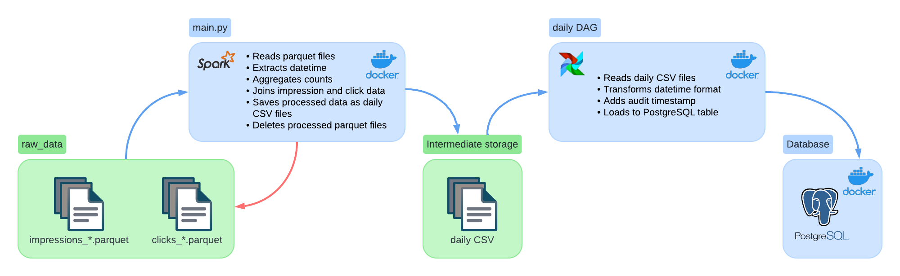

# Impressions & Clicks Pipeline
A data engineering solution for processing impression and click data.

## Overview
This project implements a data pipeline that processes impression and click data using Apache Spark and Apache Airflow. It provides automated data processing, aggregation, and storage capabilities with a containerized setup using Docker.

## Features
- Data processing with Apache Spark
- Automated workflow orchestration using Apache Airflow
- Containerized setup with Docker
- PostgreSQL database integration
- Hourly aggregation of impressions and clicks
- Audit trail for data loading

## Architecture
- **Apache Spark**: Data processing and transformation
- **Apache Airflow**: Workflow orchestration
- **PostgreSQL**: Data storage
- **Docker**: Containerization and deployment

## Data Source
The project processes data from the `raw_data` folder which contains two types of Parquet files:
- impressions_*.parquet
- clicks_*.parquet

## Prerequisites
- Docker
- Docker Compose
- Python 3.8+
- Astro CLI (Airflow)

## Installation & Setup

### 1. Clone the Repository
```bash
git clone https://github.com/VytautasPliadis/Impressions-Clicks.git
cd Impressions-Clicks
```

### 2. Environment Setup
Build-run the Spark application and PostgreSQL database:
```bash
docker compose build
docker compose run spark /opt/bitnami/spark/bin/spark-submit main.py --user-agent "some user agent"
```

### 3. Airflow Configuration
1. Create an Astro project
```bash
astro dev init
astro dev start
```

2. Configure Astronomer Airflow by editing `.astro/config.yaml`:
```yaml
project:
    name: impressions-clicks
mounts:
  - name: output
    path: /usr/local/airflow/output
    local_path: ./output
```

3. Set up PostgreSQL connection in Airflow UI:
```
Connection Id: postgres_data
Connection Type: Postgres
Host: host.docker.internal
Database: db
Login: postgres
Password: postgres
Port: 5433
```

### 4. Running the Pipeline
Execute the DAG for processing CSV files:
```bash
# Airflow web server's Docker container
airflow dags backfill task_2 -s 2022-05-26 -e 2022-05-28
```

# Data Pipeline Workflow

## Pipeline Steps

### 1. Data Ingestion (Spark)
- **Input**: Raw Parquet files (`impressions_*.parquet` and `clicks_*.parquet`)
- **Location**: `raw_data/` directory
- **Processing**:
  - Filters data by specified user agent
  - Extracts date and hour from filenames
  - Aggregates counts by date and hour

### 2. Data Transformation (Spark)
- Joins impression and click data
- Fills missing values with zeros
- Creates unified dataset with columns:
  - date
  - hour
  - impression_count
  - click_count

### 3. Intermediate Storage
- Saves processed data as daily CSV files
- Output location: `output/{YYYY-MM-DD}.csv`
- Removes processed Parquet files after successful processing

### 4. Data Loading (Airflow)
- **Schedule**: Daily at 00:00
- **Process**:
  1. Reads daily CSV files
  2. Transforms datetime format
  3. Adds audit timestamp
  4. Loads to PostgreSQL table `csv_data_task`

### 5. Final Storage (PostgreSQL)
- **Table Schema**:
```sql
CREATE TABLE csv_data_task (
    datetime TIMESTAMP NOT NULL,
    impression_count BIGINT NOT NULL,
    click_count BIGINT NOT NULL,
    audit_loaded_datetime TIMESTAMP NOT NULL
)
```

## Sample Output
The pipeline generates hourly aggregations in the following format:
```
| datetime                | impression_count | click_count | audit_loaded_datetime   |
|-------------------------|------------------|-------------|-------------------------|
| 2022-05-26 11:00:00.000 | 4                | 0           | 2025-01-20 04:20:44.061 |
| 2022-05-26 19:00:00.000 | 10               | 0           | 2025-01-20 04:20:44.061 |
| 2022-05-27 11:00:00.000 | 0                | 10          | 2025-01-20 04:20:45.109 |
| 2022-05-27 12:00:00.000 | 10               | 20          | 2025-01-20 04:20:45.109 |
  
# Connect to the container
docker exec -it postgres_db bash

# Connect to PostgreSQL using psql
psql -U postgres -d db

# List all tables
\dt

# Query the table
SELECT * FROM csv_data_task;
```